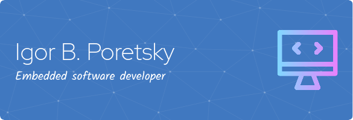

### Hi there 👋, My name is Igor
#### I am a software developer and accessibility expert

My main professional areas include:

- Embedded software development;
- Lo-level programming in Linux;
- Android applications development;
- Mathematics;
- Accessibility solutions.

The latter is the subject of the most my volunteer activities.

  

  

  
